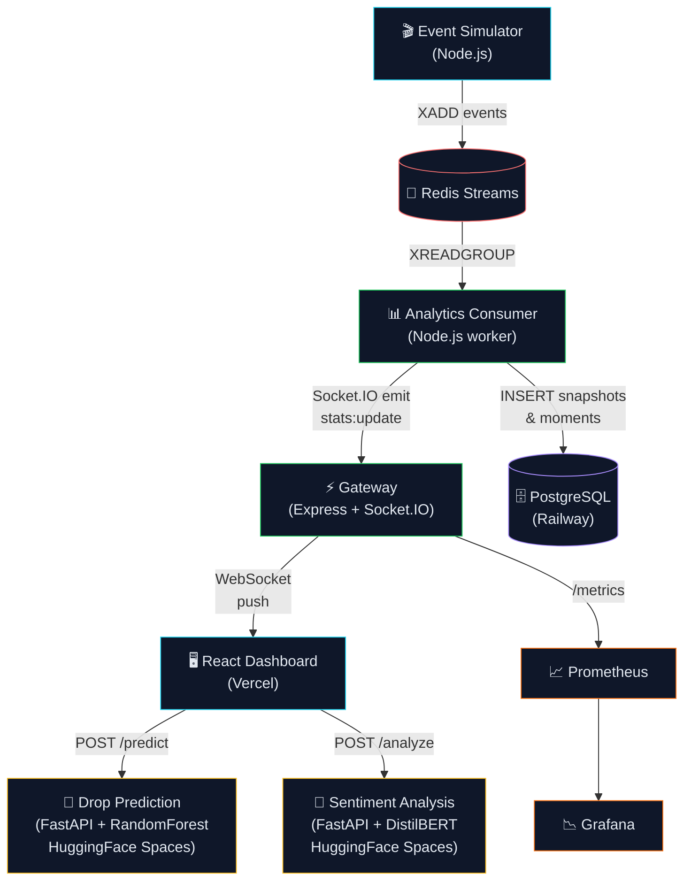

# StreamPulse AI 🎬

> **Real-time live stream intelligence platform** — concurrent viewer analytics, AI-powered drop prediction, live sentiment analysis, and trending moment detection. Built for streaming infrastructure.

[](https://streampulse-ai.vercel.app)
[](https://streampulse-gateway.onrender.com/health)
[](https://huggingface.co/spaces/YOUR_USERNAME/streampulse-drop)
[](https://huggingface.co/spaces/YOUR_USERNAME/streampulse-sentiment)


---

## What It Does

StreamPulse AI ingests simulated viewer events from a live stream, processes them through a Redis Streams pipeline, and surfaces real-time intelligence on a React dashboard — all powered by two independent ML microservices.

| Capability | Implementation |
|---|---|
| **Live viewer tracking** | WebSocket push via Socket.IO — sub-second latency |
| **Drop prediction** | RandomForest trained on 8,000 synthetic samples — no dataset download |
| **Sentiment analysis** | DistilBERT SST-2 (~260MB) running 100% locally on CPU |
| **Trending moments** | Sliding window algorithm — flags >20% viewer spike in <60s |
| **Alert system** | Threshold-based alerts persisted to PostgreSQL + pushed via Socket.IO |
| **Mock mode** | Full dashboard works offline — toggle in the UI header |

---

## Architecture



---

## Tech Stack

### Backend — Node.js Gateway (`/gateway`)
| Tech | Role |
|---|---|
| Express.js | REST API server |
| Socket.IO | WebSocket event push to dashboard |
| ioredis | Redis Streams producer (`XADD`) + consumer (`XREADGROUP`) |
| node-postgres | PostgreSQL connection pool |
| prom-client | Prometheus metrics at `/metrics` |
| Winston | Structured logging |

### ML Services — Python FastAPI
| Service | Model | Hosting |
|---|---|---|
| Drop Prediction | RandomForestClassifier (scikit-learn) | HuggingFace Spaces CPU |
| Sentiment Analysis | DistilBERT SST-2 (HuggingFace Transformers) | HuggingFace Spaces CPU |

### Frontend — React Dashboard (`/dashboard`)
| Tech | Role |
|---|---|
| React 18 + Vite | SPA framework |
| Tailwind CSS | Utility-first styling |
| Recharts | Line chart + radial bar gauge |
| Socket.IO Client | Live WebSocket connection |
| Mock mode | Full offline demo without any backend |

### Infrastructure
| Service | Platform | Cost |
|---|---|---|
| PostgreSQL | Railway.app | ₹0 (free credit) |
| Redis Streams | Railway.app | ₹0 (free credit) |
| Gateway API | Render.com | ₹0 (free tier) |
| ML Services ×2 | HuggingFace Spaces | ₹0 (free CPU) |
| Dashboard | Vercel | ₹0 (free forever) |
| Monitoring | Grafana + Prometheus | ₹0 (self-hosted in Docker) |

---

## Dashboard Panels

| Panel | Description |
|---|---|
| **Live Viewer Count** | Real-time concurrent viewers with trend % and sparkline |
| **Engagement Chart** | 60-point Recharts line chart — engagement vs buffering rate |
| **AI Drop Risk Meter** | Radial arc gauge 0–100% — color coded low/medium/high/critical |
| **Buffering Gauge** | Segmented bar with healthy/elevated/critical thresholds |
| **Sentiment Meter** | 3-bar positive/neutral/negative — powered by DistilBERT |
| **Trending Moments** | Auto-detected viewer spike feed with replay badges |
| **Alert Feed** | Severity-coded threshold breach notifications |

---

## ML Model Details

### Drop Prediction (`/ml-drop-prediction`)
- **Model:** `RandomForestClassifier` — 100 trees, max depth 8
- **Training data:** 8,000 synthetic samples generated at startup (no download needed)
- **Features:** `buffering_rate`, `avg_bitrate_kbps`, `watch_percentage`, `time_of_day_hour`, `engagement_score` + 3 derived features
- **Accuracy:** ~87% on held-out test set
- **Inference:** ~4ms per prediction on CPU
- **API:** `POST /predict` → `{ drop_probability, risk_level, confidence, inference_ms }`

### Sentiment Analysis (`/ml-sentiment`)
- **Model:** `distilbert-base-uncased-finetuned-sst-2-english` (~260MB)
- **Inference:** 100% local on CPU — zero external API calls
- **Neutral mapping:** Confidence < 0.65 → neutral (gives realistic 3-way split)
- **Throughput:** ~100ms for 10 texts on CPU
- **API:** `POST /analyze` → `{ results[], aggregate: { positive, neutral, negative } }`

---

## Local Development

### Prerequisites
- Docker Desktop
- Git

### Run everything locally

```bash
git clone https://github.com/YOUR_USERNAME/streampulse-ai.git
cd streampulse-ai
cp .env.example .env
docker compose up --build
```

**Service URLs after startup:**

| Service | URL |
|---|---|
| Dashboard | http://localhost:5173 |
| Gateway API | http://localhost:4000 |
| Drop ML Swagger | http://localhost:8001/docs |
| Sentiment Swagger | http://localhost:8002/docs |
| Grafana | http://localhost:3001 (admin/admin) |
| Prometheus | http://localhost:9090 |

### Test ML endpoints

```bash
# Drop prediction
curl -X POST http://localhost:8001/predict \
  -H "Content-Type: application/json" \
  -d '{"buffering_rate":0.35,"avg_bitrate_kbps":1200,"watch_percentage":0.3,"time_of_day_hour":20,"engagement_score":0.4}'

# Sentiment analysis
curl -X POST http://localhost:8002/analyze \
  -H "Content-Type: application/json" \
  -d '{"texts":["Amazing stream!","This keeps buffering","okay I guess"]}'

# Live stats
curl http://localhost:4000/api/stats/live

# Trending moments
curl http://localhost:4000/api/streams/00000000-0000-0000-0000-000000000001/moments
```

### Run stages separately (low-RAM machines)

```bash
docker compose up -d redis postgres          # infrastructure
docker compose up -d --build gateway         # Node.js
docker compose up -d --build ml-drop         # Python RF
docker compose up -d --build ml-sentiment    # Python DistilBERT
docker compose up -d prometheus grafana      # monitoring
```

---

## API Reference

### Gateway REST (`http://localhost:4000`)

| Method | Endpoint | Description |
|---|---|---|
| GET | `/health` | Service health check |
| GET | `/metrics` | Prometheus metrics |
| GET | `/api/stats/live` | Latest snapshot for all active streams |
| GET | `/api/stats/history/:streamId` | Last N snapshots for charting |
| GET | `/api/stats/alerts/:streamId` | Recent threshold alerts |
| GET | `/api/streams` | List all streams |
| GET | `/api/streams/:id` | Single stream detail |
| GET | `/api/streams/:id/moments` | Trending moments feed |
| GET | `/api/streams/:id/sentiment` | Latest sentiment snapshot |

### Socket.IO Events

| Event | Direction | Payload |
|---|---|---|
| `join:stream` | Client → Server | `streamId` |
| `stats:update` | Server → Client | Full analytics snapshot |
| `moment:detected` | Server → Client | Trending moment object |
| `alert:new` | Server → Client | Alert object with severity |

---

## Project Structure

```
streampulse-ai/
├── gateway/                    # Node.js event gateway
│   └── src/
│       ├── config/             # Redis + PostgreSQL connections
│       ├── consumers/          # Redis Streams analytics consumer
│       ├── producers/          # Event simulator
│       ├── routes/             # REST API endpoints
│       ├── utils/              # Logger + Prometheus metrics
│       ├── socket.js           # Socket.IO server
│       └── app.js              # Express app
├── ml-drop-prediction/         # FastAPI drop prediction service
│   ├── main.py                 # RandomForest model + endpoints
│   ├── requirements.txt
│   └── Dockerfile
├── ml-sentiment/               # FastAPI sentiment service
│   ├── main.py                 # DistilBERT inference + endpoints
│   ├── requirements.txt
│   └── Dockerfile
├── dashboard/                  # React + Vite frontend
│   └── src/
│       ├── components/panels/  # All UI panels
│       ├── hooks/              # useStreamData (Socket.IO + REST)
│       └── lib/                # Mock data + utilities
├── postgres/migrations/        # PostgreSQL schema
├── monitoring/                 # Prometheus + Grafana config
├── docker-compose.yml          # Full local dev stack
├── render.yaml                 # Render.com deployment config
└── DEPLOYMENT.md               # Full deployment guide
```

---

## Deployment

See [DEPLOYMENT.md](./DEPLOYMENT.md) for the complete step-by-step guide.

**Quick summary:**
1. **Railway** → PostgreSQL + Redis (run `001_init.sql` migration)
2. **HuggingFace Spaces** → `streampulse-drop` + `streampulse-sentiment`
3. **Render** → Gateway with Railway + HF Space URLs as env vars
4. **Vercel** → Dashboard with Render + HF Space URLs as env vars
5. **UptimeRobot** → Ping `/health` every 10min to keep Render awake

---

## Monitoring

Local Grafana dashboard at **http://localhost:3001** (admin/admin) shows:
- Concurrent viewers gauge
- Events per second time series
- Buffering rate gauge
- Drop probability gauge

Prometheus scrapes the gateway at `/metrics` every 10 seconds.

---

## Roadmap

- [ ] Multi-stream support (currently demo stream only)
- [ ] Real chat ingestion via YouTube/Twitch API
- [ ] CDN recommendation engine based on drop prediction
- [ ] Geographic viewer distribution heatmap
- [ ] Kafka migration for production-scale throughput

---

## Author

Built as a portfolio project targeting streaming infrastructure roles at companies like **JioHotstar**, **Netflix India**, and **Sony LIV**.

**Total cost to run: ₹0/month.**
